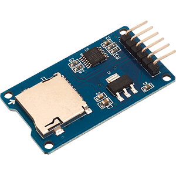
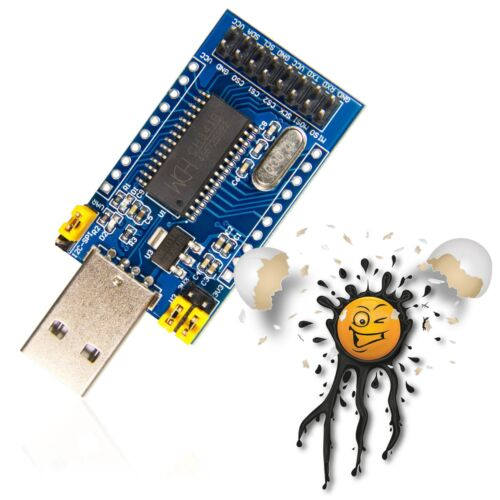

# spi_sd_card_reader

Windows Software to read and write a SD card via SPI


## Credit and Links

Source code inspired by:

* https://www.rjhcoding.com/avrc-sd-interface-1.php
* https://github.com/hpaluch/ch341-spi-shift-reg
* https://www.rjhcoding.com/avrc-sd-interface-1.php

* https://tad-electronics.com/2019/03/10/ch341a-mini-programmer-schematic-and-drivers/
* https://www.wch.cn/download/CH341EVT_ZIP.html
* https://www.wch.cn/download/CH341PAR_EXE.html
* https://github.com/hpaluch/ch341-i2c-24c01c?tab=readme-ov-file
* https://github.com/hpaluch/ch341-i2c-24c01c
* https://github.com/hpaluch/hpaluch.github.io/wiki/Getting-started-with-LC-CH341A-USB-conversion-module
* https://github.com/hpaluch/ch341-spi-shift-reg

* http://www.chinalctech.com/cpzx/Programmer/Serial_Module/2019/0124/266.html


## Drivers on Windows

Install the driver: (This is the multiprotocol driver)
https://www.wch.cn/download/CH341PAR_EXE.html

Do not install CH341SER.EXE, it is only for USB to serial.

CH341SER.EXE – self installing archive with USB to serial driver.
CH341PAR.EXE – self installing archive with multiprotocol interface driver (this one is for the programmer mode)

In the Device Manager, there will be a new node, when plugging in the device.
The node is called Interface. Withint the Interface node, you will have USB-EPP/I2C... CH341A


## Source Code for Applications

https://github.com/hpaluch/ch341-i2c-24c01c?tab=readme-ov-file

Download and install CH341PAR.ZIP (https://www.wch.cn/downloads/CH341PAR_ZIP.html) - USB driver for CH341 chip in Parallel mode (EPP, MEM) + SourceCode!!!!!!!!!!!!
This driver is valid also for I2C mode and SPI mode (yes - even when it is marked parallel).

C:\Users\U5353\Downloads\CH341PAR.ZIP


## Overview

This repository is about accessing a SD card via a small SD card reader breakout board:



The SD card reader breakout board is accessed using the SPI procotol. To be able to talk
to the breakout board from Windows, a SPI debugger is used:



This specific debugger uses a windows driver which has to be installed (CH341PAR.ZIP).
The manufacturer does provide a windows library to talk to the debugger from a C++ windows application.
This library is able to communicate over USB and wraps all the USB traffic within the provided API.


## Using the CH341PAR library

The CH341PAR library provides several functions out of which the functions 

* CH341GetVersion()
* CH341GetDeviceName()
* CH341OpenDevice()
* CH341SetStream()
* CH341StreamSPI4()
* CH341CloseDevice() 

are used.

### CH341GetVersion()

CH341GetVersion() returns the version number of the CH341PAR library release used.

### CH341GetDeviceName()

CH341GetDeviceName() returns the human readable name of the USB SPI debugger.

### CH341OpenDevice()

CH341OpenDevice() does scan the USB bus for all devices of the specific vendor and the specific device id. In USB
programming, all plugged in devices will be iterated over initially. Each device identifies using a vendor and a device
id. If you plug in two or more of the SPI debuggers into your PC, severeal devices will be iterated having the exact same
vendor id and device id and the CH341PAR library has to be told which of the devices you want to access.

To specify the device, a variable is defined:

```
ULONG iDevIndex = 0;
```

This will select the first device that is encountered on the USB bus having the specific device id and vendor id.

```
printf("Opening device# %lu\r\n", iDevIndex);
HANDLE h341 = CH341OpenDevice(iDevIndex);
if (h341 == NULL) {
	printf("OpenDevice(iDevIndex=%lu) failed\r\n", iDevIndex);
	return 0;
}
else {
	printf("OpenDevice(iDevIndex=%lu) succeeded!\r\n", iDevIndex);
}
```

### CH341SetStream()

Once the device is opened, CH341SetStream() is used to select the operating mode of the USB debugger.
The debugger does support SPI, UART and I2C. In order to make the USB adapter talk SPI, 

```
CH341SetStream(iDevIndex, 0x81)
```

is used.

### CH341StreamSPI4()

CH341StreamSPI4() is used to send and receive bytes. The function actually does perform a send operation
and also a receive operation at the same time! There is no specific read and write operation for SPI in the API!

If you want to send a single byte of data, call CH341StreamSPI4() with a buffer size of one. 

The USB SPI debugger will answer with a byte for each byte it receives, no matter if the SD card has actually answered with abyte! 

If the SD card plugged into the SD SPI card reader breakout board receives the
byte, processes it and produces an response byte fast enough, then this byte is returned by the USB adapter. CH341StreamSPI4() will place
the returned byte into the buffer that is used to initially provide the request! This means that the same buffer is 
used to contain the request and the request is then overriden to contain the response!

If the SD card is not fast enough to produce a response byte, it will not pull the lines low and the SD Card reader breakout 
board will read from the lines anyways. It will then read all high values, since the SD card does not pull any of the lines low.
This means that if the SD card has not produced any output yet, you will read 0xFF (all lines high).

If specific protocol spoken over SPI (in this case, the SD SPI card protocol) defines a response of 0x01 but you read 0xFF,
then this most likely means that the card has not yet processed the request and has not yet output the 0x01 byte! 
The solution to this situation is to keep sending dummy data to the SD card over SPI in order to poll the SD card 
until it actually answers with the defined 0x01 byte! For dummy data, the specific byte 0xFF is used. I do not know why
exactly, but only 0xFF seems to work in order to poll the SD card!

So the take away is:

1. To talk to the SPI SD card, use CH341StreamSPI4()
1. CH341StreamSPI4() does perform sending and receiving at the same time
1. The data in the buffer of bytes used to store the request send via CH341StreamSPI4() is replaced with response bytes.
1. For each byte send, a byte is read. If your buffer has a length of 5 and you send all 5 bytes, then the buffer is manipulated
and 5 bytes of response are stored in the buffer

Here is an implementation of a function that sends and receives a single byte.

```
uint8_t SPI_transfer(uint8_t data) 
{
	//printf(">> %x\r\n", data);
	uint8_t ioBuf[1];
	ioBuf[0] = data;

	if (!CH341StreamSPI4(iDevIndex, chip_select, 1, ioBuf)) {
		printf("CH341StreamSPI4 failed\r\n");
		return 0x00;
	}

	//printf("<< %x\r\n", ioBuf[0]);
	return ioBuf[0];
}
```

### CH341CloseDevice()

CH341CloseDevice(iDevIndex); closes the USB device


## Initializing the SD Card

Once the SPI protocol layer is mastered and you are able to read bytes, then the next layer of the software will be
to use the SD card protocol to initialize the SD card.

SD cards do have internal circuitry and internal state. A SD card can execute a protocol. Initially a SD card starts
up in a state where it does not talk SPI. It talks some other protocol (SD I think). In order to disable
the SD protocol and activate the SPI protocol certain messages have to be send to the SD card using the USB SPI
debugger.

Switching the SD card into SPI mode, reseting and starting it is called the "Initialization Sequence".
This page https://www.rjhcoding.com/avrc-sd-interface-1.php describes a sequence of messages to send over SPI in
order to perform all required steps. Following this tutorial worked for me with the USB SPI debugger, the breakout
board and the specific SD cards that I used for testing.

## Reading Blocks from the SD Card

Once the Card is initialized and ready to be read, entire blocks can be read from the SD card.
The block size can be changed in theory but it is recommended to keep the default of 512 bytes per block.

In order to read a block, the SD card has to have gone through the initialization process and it has to be ready
for data reading.

The way to read data from a SD card is to read an entire block. To read a block the index of the block to read
is sent to the SD card using the CMD 17! Once CMD 17 is sent and a positive response byte 0x01 is received, the 
SD card will then produce the bytes from that specific block. In order to produces those bytes, you have to 
poll the card with the 0xFF byte to read the next byte from the block.

512 bytes have to be read from the SD card by sending the dummy byte 0xFF 512 times. For each dummy byte 0xFF,
one byte of the block is returned by the SD card.

Here is a implementation of a block reading function. Be aware that this implementation is very inefficient in that
it reads a single byte at a time instead of large chunks of data (I tested with a byte buffer of 512 bytes and the
data received is corrupted! So currently I have no solution on how to read a block more efficiently!)

```
uint8_t SD_readSingleBlock(uint32_t addr, uint8_t *buf, uint8_t *token) 
{    
	uint8_t res1;
	uint8_t read;    
	uint16_t readAttempts = 0;    
	
	// set token to none    
	*token = 0xFF; 
	
	// send CMD17    
	SD_command(CMD17, addr, CMD17_CRC);    
	
	// read R1    
	res1 = SD_readRes1();    
	
	// if response received from card    
	if (res1 != 0xFF)    
	{
		// wait for a response token 0xFE because the SD Card takes some time to produce data (timeout = 100ms)        
		readAttempts = 0;        
		while (++readAttempts != SD_MAX_READ_ATTEMPTS)
		{
			if ((read = SPI_transfer(0xFF)) != 0xFF)
			{
				break;
			}
		}
		
		// if response token is 0xFE        
		if (read == 0xFE)        
		{            
			// read 512 byte block            
			for (uint16_t i = 0; i < 512; i++)
			{
				*buf++ = SPI_transfer(0xFF);
			}
			
			// read 16-bit CRC            
			SPI_transfer(0xFF);            
			SPI_transfer(0xFF);
		}
		else
		{
			printf("Could not read from card!\r\n");
		}
		
		// set token to card response        
		*token = read;    
	}   
	
	return res1;
}
```

### Dealing with Partitions and File Systems

At this point, we are able to communicate over SPI. The card is initialized and individual blocks can be read.
This means that all the infrastructure we need is in place.

The next step is to start interpreting the bytes that are read (per block) from the SD card.
The bytes on the SD card do depend on the bytes that the user has written onto the SD card in the first place.

I think that there is a wide range of possibilities in which a user can use a SD card.
So milleage will vary. It depends on how you have formatted your specific SD card!

In this document I will describe a scenario that is common in embedded systems.
In embedded systems, a sd card often times is used as a replacement for a hard drive.

As such the sd card is partitioned like a hard drive can be partitioned.
The partitioning scheme is the top most layer that we have to deal with.
It is most likely the partitioning scheme defined by Microsoft.

The first block (block index 0, 512 bytes) of the SD card contains the MBR (Master Boot Record)
This MBR is constructed according to a specific format but the bytes that are written into the individual parts
vary.

In my example SD Cards, the first block looks like this:

```
ff ff ff ff ff ff ff ff ff ff ff ff ff ff ff ff 
ff ff ff ff ff ff ff ff ff ff ff ff ff ff ff ff 
ff ff ff ff ff ff ff ff ff ff ff ff ff ff ff ff 
ff ff ff ff ff ff ff ff ff ff ff ff ff ff ff ff 
ff ff ff ff ff ff ff ff ff ff ff ff ff ff ff ff 
ff ff ff ff ff ff ff ff ff ff ff ff ff ff ff ff 
ff ff ff ff ff ff ff ff ff ff ff ff ff ff ff ff 
ff ff ff ff ff ff ff ff ff ff ff ff ff ff ff ff 
ff ff ff ff ff ff ff ff ff ff ff ff ff ff ff ff 
ff ff ff ff ff ff ff ff ff ff ff ff ff ff ff ff 
ff ff ff ff ff ff ff ff ff ff ff ff ff ff ff ff 
ff ff ff ff ff ff ff ff ff ff ff ff ff ff ff ff 
ff ff ff ff ff ff ff ff ff ff ff ff ff ff ff ff 
ff ff ff ff ff ff ff ff ff ff ff ff ff ff ff ff 
ff ff ff ff ff ff ff ff ff ff ff ff ff ff ff ff 
ff ff ff ff ff ff ff ff ff ff ff ff ff ff ff ff 
ff ff ff ff ff ff ff ff ff ff ff ff ff ff ff ff 
ff ff ff ff ff ff ff ff ff ff ff ff ff ff ff ff 
ff ff ff ff ff ff ff ff ff ff ff ff ff ff ff ff 
ff ff ff ff ff ff ff ff ff ff ff ff ff ff ff ff 
ff ff ff ff ff ff ff ff ff ff ff ff ff ff ff ff 
ff ff ff ff ff ff ff ff ff ff ff ff ff ff ff ff 
ff ff ff ff ff ff ff ff ff ff ff ff ff ff ff ff 
ff ff ff ff ff ff ff ff ff ff ff ff ff ff ff ff 
ff ff ff ff ff ff ff ff ff ff ff ff ff ff ff ff 
ff ff ff ff ff ff ff ff ff ff ff ff ff ff ff ff 
ff ff ff ff ff ff ff ff ff ff ff ff ff ff ff ff 
ff ff ff ff ff ff ff ff 34 28 e0 97 00 00 80 20 
21 00 0c 71 21 10 00 08 00 00 00 00 04 00 00 71 
22 10 83 8a 08 82 00 08 04 00 00 f8 1b 00 00 00 
00 00 00 00 00 00 00 00 00 00 00 00 00 00 00 00 
00 00 00 00 00 00 00 00 00 00 00 00 00 00 55 aa
```

The format is:

* First 440 bytes are reserved for boot code for the initial boot loader. (Here: 0xFF ... 0xFF)
* Disk signature (4 byte) 34 28 e0 97
* Null Bytes (2 byte) 00 00
* Partition table: (64 byte) Four 16 byte entries
* end marker 0x55 (01010101 binary) 0xAA (10101010 binary)

As you can see in the example MBR above, there is no machine code in the first 440 bytes.
Instead the creator of the SD card has entered 0xFF into the first 440 bytes. This was 
probably done because the embedded system will not execute the boot code stored in the
first 440 bytes but it has it's own specific startup process!

The disk signature is 34 28 e0 97 (I do not know what that means!)

The null bytes are present.

The partition table consists of four 16 byte entries:

| (0x80 == bootable) |  Starting Sector ( in CHS ) | File System Type | Last Sector ( in CHS ): | Start Offset | Length |
|----------------------------------|-----------------------------|------------------|-------------------------|--------------|--------|
|[80]|[20 21 00]|[0c]|[71 21 10]|[00 08 00 00]|[00 00 04 00]|
|[00]|[71 22 10]|[83]|[8a 08 82]|[00 08 04 00]|[00 f8 1b 00]|
|[00]|[00 00 00]|[00]|[00 00 00]|[00 00 00 00]|[00 00 00 00]|
|[00]|[00 00 00]|[00]|[00 00 00]|[00 00 00 00]|[00 00 00 00]|

The MBR is explained here:

* https://en.wikipedia.org/wiki/Master_boot_record
* https://thestarman.pcministry.com/asm/mbr/PartTables3.htm
* https://thestarman.pcministry.com/asm/mbr/PartTypes.htm

Because the bytes are stored big endian, the byte sequence has to be inverted to arrive at Windows little endian.
The first partition starts at 0x00 0x80 0x00 0x00 -> 0x00000800.

In the specific partition table above, it can be seen that only the first two of the four partition entries are used
because the lower two entries are filled with 0x00 which means they are empty.

The first entry (is bootable) has a file system type of 0x0C which is "32-bit FAT, using INT 13 Extensions".
The second entry is of type 0x83: "Linux native file systems (ext2/3/4, JFS, Reiser, xiafs, and others)".

What happens if this SD card is plugged into a SD Card Reader and the SD Card Reader is plugged into a Windows 10 PC?
The Windows operating system will try to mount all the partitions and it tries to show all the partitions in the 
explorer application so that the user can browse the files stored on the partition. Because Windows 10 has no automatic
support for the linux partition (file system type 0x83), this partition will not show up in windows, although it exists
on the SD card!

With our SD Card reader application, the question becomes, how many file systems do you want to support?


## Reading File System Types

The first step is most likely to support the FAT32 file system type. The reason is that FAT32 is used by many
devices so it is a good idea to have code in your portfolio that reads FAT32. Also FAT32 is documented (in very
confusing way) and it is not too hard to implement (in a naive fashion).

Therefore, read the MBR and parse the partition table.
If the file system type is 0x0C, read the start offset.

When the start offset is read, this offset can be used to read that specific block from the SD card.

```
// 512 dummy bytes to poll the entire block
for (uint16_t i = 0; i < 512; i++)
{
	sdBuf[i] = 0xFF;
}

// token respons of the reader routine
uint8_t token;

// block index
uint32_t block_index = 0x00000800;

// read the entire block into the sdBuf
SD_readSingleBlock(block_index, sdBuf, &token);
```

This block on the SD Card contains the first block in that partition.

From here on out, you have to activate the FAT32 code that interprets all bytes as being FAT32 data!
(If the partition was of another file system type, you have to activate the code that processes that specific file system!)

Here is one very important fact to realize when processing a partition specifically from a SD card:

The FAT32 data in a FAT32 file system uses relative values. For example, there are formulae that will compute the block
that stores all entries in a directory for example. The formula outputs a block index but this index is relative 
to the partition! The FAT32 file system does not know where on the SD card it is stored and it does not care.
The FAT32 file system is self-containd and it operates as if it begins at block index 0 no matter at which block
index it really starts!

The partition itself on the SD card already has it's own offset! (0x00000800 in the example above).
This is a slight problem that we have to deal with. When the FAT32 file system says: You will find all files
of the directory at block 14 (as an example), then on the SD Card, the block index 14 has to be pre processed first!
The absolute offset of the partition start has to be added to the (relative) block index 14 to translate the relative
block index 14 to the absolute block index!

This means to resolve the absolute block index, you have to combine the block index of the partition with the block index
returned by the formula! If you do not resolve the block to a correct absolute value, then you will read data from an incorrect block!

One approach I am thinking about would be to have a global variable that stores the start index of the partition.
The before accessing the SD Card, this start index is added to each value computed from the FAT32 implementation.


## FAT 32


